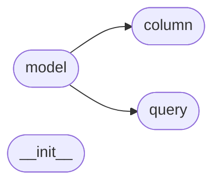

# Code Overview

[_Documentation generated by Documatic_](https://www.documatic.com)

<!---Documatic-section-Codebase Structure Python-start--->
## Codebase Structure Python

The codebase has a flat structure, with 4 code files.

<!---Documatic-block-system_architecture-start--->

<!---Documatic-block-system_architecture-end--->

# #
<!---Documatic-section-Codebase Structure Python-end--->

<!---Documatic-section-Class Hierarchy-start--->
## Class Hierarchy

<!---Documatic-block-Exception-start--->

	
<code>Exception</code> (Click to Expand!)

* subconscious.column.InvalidColumnDefinition
* subconscious.model.BadDataError
* subconscious.model.InvalidModelDefinition
* subconscious.model.InvalidQuery
* subconscious.model.UnexpectedColumnError

<!---Documatic-block-Exception-end--->

<!---Documatic-block-object-start--->

	
<code>object</code> (Click to Expand!)

* subconscious.column.Column
* subconscious.model.RedisModel
* subconscious.query.Query

<!---Documatic-block-object-end--->

<!---Documatic-block-subconscious.column.Column-start--->

	
<code>subconscious.column.Column</code> (Click to Expand!)

* subconscious.column.Integer

<!---Documatic-block-subconscious.column.Column-end--->

<!---Documatic-block-type-start--->

	
<code>type</code> (Click to Expand!)

* subconscious.model.ModelMeta

<!---Documatic-block-type-end--->

# #
<!---Documatic-section-Class Hierarchy-end--->

[_Documentation generated by Documatic_](https://www.documatic.com)